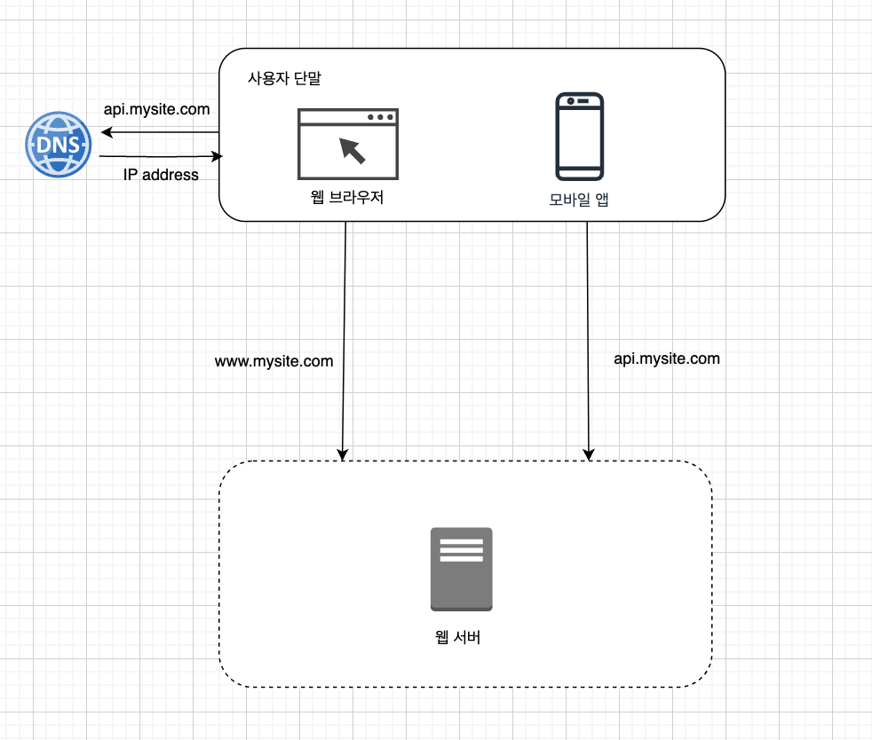
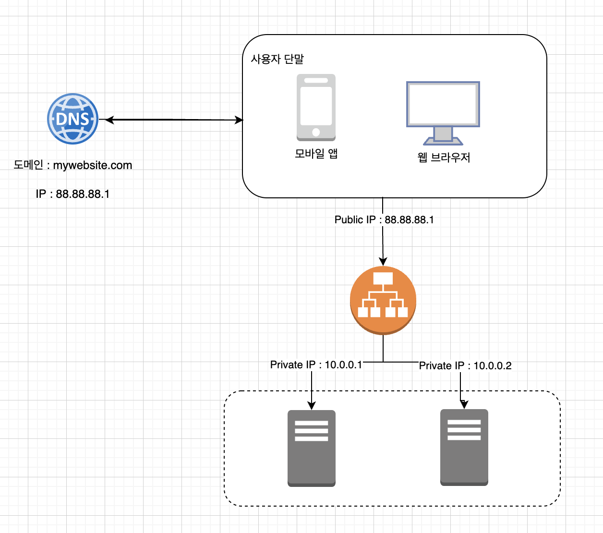
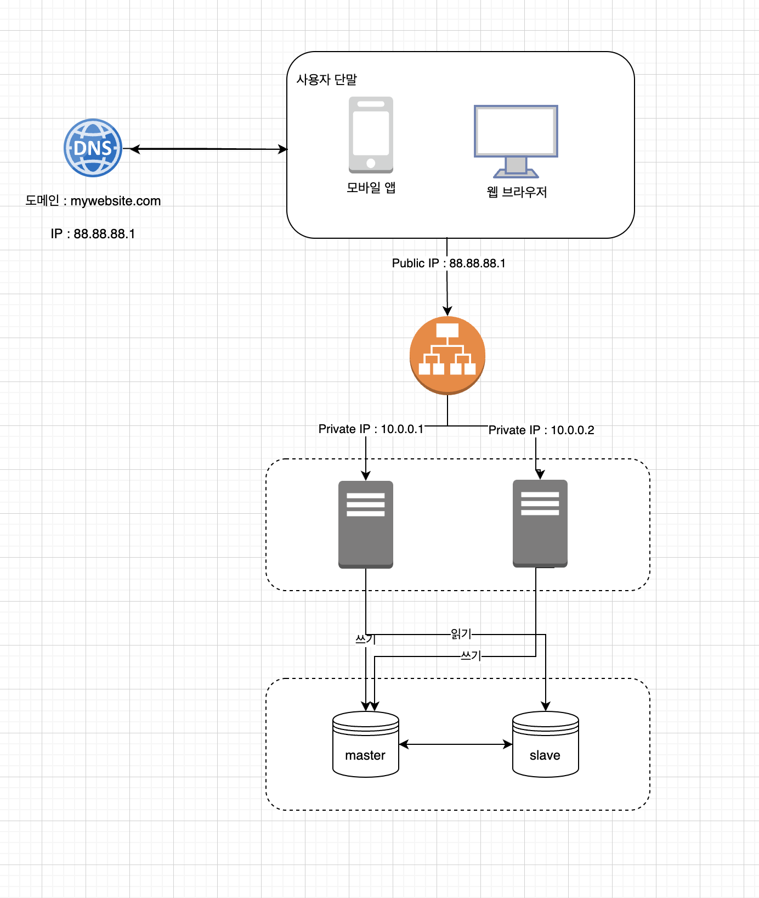
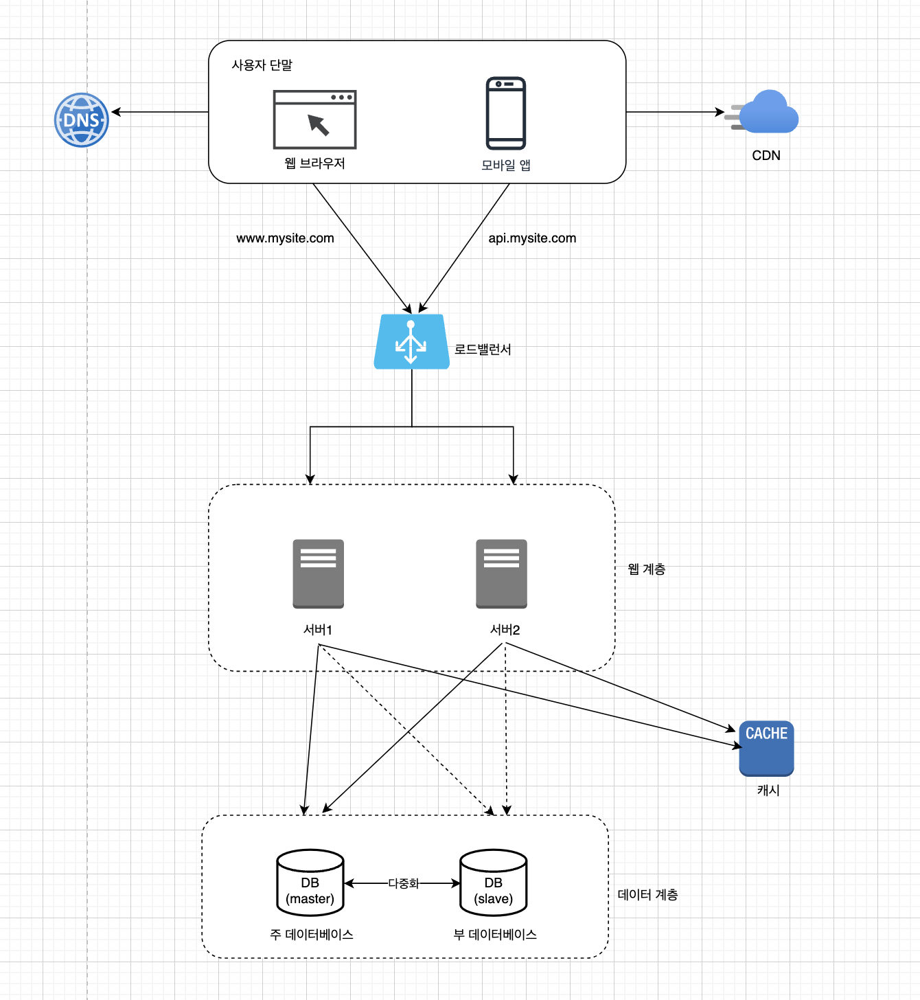
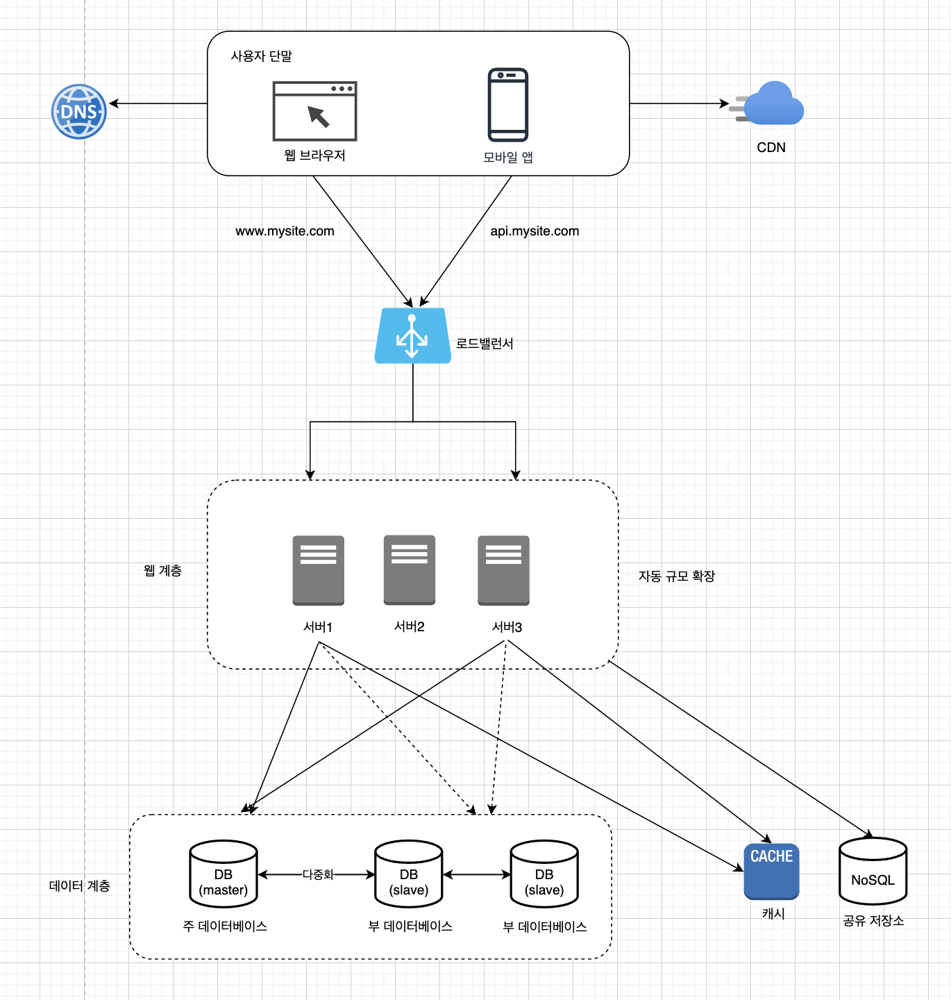
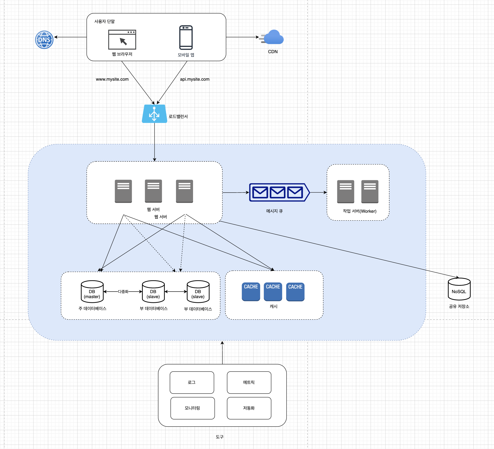
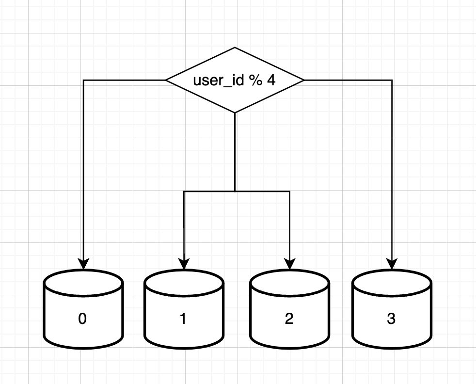

# 1장. 사용자 수에 따른 규모 확장성

> 가상 면접 사례로 배우는 대규모 시스템 설계 기초 정리한 내용입니다.
> 

## 단일 서버

### 사용자 요청 처리 흐름

1. 사용자는 도메인 이름(api.mysite.com)을 이용하여 웹사이트에 접속한다. 이 접속을 위해서는 도메인 이름을 도메인 이름 서비스(DNS)에 질의하여 IP 주소로 변환하는 과정이 필요하다. (DNS는 보통 제 3 사업자(third party)가 제공하는 유료 서비스를 이용하게 되므로, 우리 시스템의 일부는 아니다.)
2. DNS 조회 결과로 IP 주소가 반환된다.
3. 해당 IP 주소로 HTTP 요청이 전달된다.
4. 요청을 받은 웹 서버는 HTML 페이지나 JSON 형태의 응답을 반환한다.

### 실제 요청은 어디로부터 오는지?

- 웹 애플리케이션
    - 비즈니스 로직, 데이터 저장 등을 처리하기 위해서는 서버 구현용 언어(자바, 파이썬 등)를 사용하고, 프레젠테이션용으로는 클라이언트 구현용 언어(HTML, 자바스크립트 등)를 사용한다.
- 모바일 앱
    - 모바일 앱과 웹 서버 간 통신을 위해서는 HTTP 프로토콜을 이용한다. HTTP 프로토콜을 통해서 반환될 응답 데이터의 포맷으로는 보통 JSON이 그 간결함 덕에 널리 쓰인다.

## 데이터베이스

사용자가 늘면 서버 하나로는 충분하지 않아서 여러 서버를 둬야 한다. 하나는 웹/모바일 트래픽 처리용도고, 다른 하나는 데이터베이스 용이다.

웹/모바일 트래픽 처리 서버(웹 계층)와 데이터베이스 서버(데이터 계층)를 분리하면 그 각각을 독립적으로 확장해 나갈 수 있게 된다.

### 어떤 데이터베이스를 사용할 것인가?

- 관계형 데이터베이스(RDBMS)
    - ex) MySQL, Oracle, PostgreSQL 등
    - 테이블, 열, 컬럼으로 표현
    - SQL을 사용하면 여러 테이블에 있는 데이터를 관계에 따라 조인(join)하여 합칠 수 있다.
- 비-관계형 데이터베이스(NoSQL)
    - ex) CouchDB, Cassandra, HBase, Amazon DynamoDB 등
    - 키-값 저장소 (key-value store)
    - 그래프 저장소 (graph store)
    - 컬럼 저장소 (column store)
    - 문서 저장소 (document store)
    - 비-관계형 데이터베이스는 일반적으로 조인 연산은 지원하지 않는다.

### 비-관계형 데이터베이스(NoSQL)가 바람직한 선택일 경우

- 아주 낮은 응답 지연시간(latency)이 요구됨
- 다루는 데이터가 비정형(unstructure)이라 관계형 데이터가 아님
- 데이터(JSON, YAML, XML 등)를 직렬화하거나(serialize) 역직렬화(deserialize)할 수 있기만 하면 됨
- 아주 많은 양의 데이터를 저장할 필요가 있음

## 수직적 규모 확장 vs 수평적 규모 확장

- 스케일 업(scale up) → 수직적 규모 확장
    - 서버에 고사양 자원(더 좋은 CPU, 더 많은 RAM 등)을 추가하는 행위
- 스케일 아웃(scale out) → 수평적 규모 확장
    - 더 많은 서버를 추가하여 성능을 개선하는 행위

### 수직적 규모 확장

서버로 유입되는 트래픽 양이 적을 경우 좋은 선택

- 장점
    - 단순하다.
- 단점
    - 한계 → 한 대의 서버에 CPU나 메모리를 무한대로 증설할 방법은 없다
    - 장애에 대한 자동복구(failover) 방안이나 다중화(re-dundancy) 방안을 제시하지 않는다. 서버에 장애가 발생하면 웹사이트/앱은 완전히 중단된다.

### 수평적 규모 확장

수직적 규모 확장의 단점 때문에, 대규모 애플리케이션을 지원하는 데 수평적 규모 확장법이 보다 적절하다.

### 로드 밸런서

- 부하 분산 집합(load balancing set)에 속한 웹 서버들에게 트래픽 부하를 고르게 분산하는 역할을 한다.

- 사용자는 로드밸런서의 공개 IP주소(public IP address)로 접속한다. 따라서 웹 서버는 클라이언트의 접속을 직접 처리하지 않는다.
- 더 나은 보안을 위해 서버 간 통신에는 사설 IP 주소(private IP Address)가 이용된다.
    - 사설 IP 주소(private IP address)
        - 같은 네트워크에 속한 서버 사이의 통신에만 쓰일 수 있는 IP 주소.
        - 인터넷을 통해서는 접속할 수 없다.
        - 로드밸런서는 웹 서버와 통신하기 위해 바로 이 사설 주소를 이용한다.
- 부하 분산 집합에 또 하나의 웹 서버를 추가하고 나면 장애를 자동복구하지 못하는 문제(no failover)는 해소되며, 웹 계층의 가용성(availablity)은 향상된다.
    - 서버 1이 다운되면 모든 트래픽은 서버2로 전송된다. 따라서 웹 사이트 전체가 다운되는 일이 방지된다. 부하를 나누기 위해 새로운 서버를 추가할 수도 있다.
    - 웹 사이트로 유입되는 트래픽이 가파르게 증가하면 두 대의 서버로 트래픽을 감당할 수 없는 시점이 오는데 로드밸런서가 있으므로 우아하게 대처할 수 있다. 웹 서버 계층에 더 많은 서버를 추가하기만 하면 된다. 그러면 로드밸런서가 자동으로 트래픽을 분산하기 시작할 것이다.

### 데이터베이스 다중화

다중화 지원 → 보통 주(master)-부(slave)

- 데이터 원본은 master 서버에, 데이터 사본은 slave 서버에 저장
    - mater 서버 : 쓰기 연산(write operation), 읽기 연산(read operation) 지원
    - slave 서버 : master 데이터베이스로부터 사본을 전달받으며, 읽기 연산(read operation)만 지원
- 대부분의 애플리케이션은 읽기 연산의 비중이 쓰기 연산보다 훨씬 높다. → slave 데이터베이스가 master 데이터베이스보다 많다.
- 장점
    - 더 나은 성능
        - master-slave 다중화 모델에서 모든 데이터 변경 연산은 주 데이터베이스 서버로만 전달되는 반면 읽기 연산은 slave 데이터베이스 서버들로 분산된다. 병렬로 처리될 수 있는 query 수가 늘어나므로 성능이 좋아진다.
    - 안정성(reliability)
        - 자연 재해 등의 이유로 데이터베이스 서버 가운데 일부가 파괴되어도 데이터는 보존될 것이다. 데이터를 지역적으로 떨어진 여러 장소에 다중화시켜 놓을 수 있기 때문이다.
    - 가용성(availability)
        - 데이터를 여러 지역에 복제해 둠으로써, 하나의 데이터베이스 서버에 장애가 발생하더라도 다른 서버에 있는 데이터를 가져와 계속 서비스할 수 있게 된다.
- 데이터베이스 하나가 다운되면?
    - slave 서버가 한 대 뿐인데 다운되면
        - 읽기 연산은 한시적으로 모든 master 데이터베이스로 전달될 것이다. 또한 즉시 새로운 slave 데이터베이스 서버가 장애 서버를 대체할 것이다.
    - slave 서버가 여러 대인 경우 다운되면
        - 읽기 연산은 나머지 slave 데이터베이스 서버들로 분산될 것이며, 새로운 slave 데이터베이스 서버가 장애 서버를 대체할 것이다.
    - master 서버가 다운되면
        - 한 대의 slave 데이터베이스만 있는 경우 해당 slave 데이터베이스 서버가 새로운 master 서버가 될 것이며 모든 데이터베이스 연산은 일시적으로 새로운 master 서버상에서 수행될 것이다. 그리고 새로운 slave 서버가 추가될 것이다.
    - 프로덕션 환경에서 벌어지는 일은 이것보다 사실 더 복잡한데 slave 서버에 보관된 데이터가 최신 상태가 아닐 수 있기 때문이다. 없는 데이터는 복구 스크립트(recovery script)를 돌려서 추가해야 한다.
        - 다중 마스터나 원형 다중화 방식을 도입하면 이 상황에 대처하는데 도움이 될 수 있지만 해당 구성은 훨씬 복잡하다.

### 결과

- 사용자는 DNS로부터 로드밸런서의 공개 IP 주소를 받는다.
- 사용자는 해당 IP 주소를 사용해 로드밸런서에 접속한다.
- HTTP 요청은 서버1이나 서버2로 전달된다.
- 웹 서버는 사용자의 데이터를 slave 데이터베이스 서버에서 읽는다.
- 웹 서버는 데이터 변경 연산은 master 데이터베이스로 전달한다. 데이터 추가, 삭제, 갱신 연산 등이 이에 해당한다.

---

응답시간(latency) 개선

- 캐시(cache)를 붙이고 정적 콘텐츠를 CDN(Content Delivery Network, CDN)으로 옮긴다.

## 캐시

- 값비싼 연산 결과 또는 자주 참조되는 데이터를 메모리 안에 두고, 뒤이은 요청이 보다 빨리 처리될 수 있도록 하는 저장소
- 애플리케이션의 성능은 데이터베이스를 얼마나 자주 호출하느냐에 따라 크게 좌우되는데 캐시는 그런 문제를 완화할 수 있다.

### 캐시 계층

캐시 계층은 데이터가 잠시 보관되는 곳으로 데이터베이스보다 훨씬 빠르다.

별도의 캐시 계층을 두면 성능이 개선될 뿐 아니라 데이터베이스의 부하를 줄일 수 있고 캐시 계층의 규모를 독립적으로 확장시키는 것도 가능해진다. 

- 읽기 주도형 캐시 전략 (read-through caching strategy)
    - 요청을 받은 웹 서버는 캐시에 응답이 저장되어 있는지를 본다.
    - 만일 저장되어 있다면 해당 데이터를 클라이언트에 반환한다.
    - 없는 경우에는 데이터베이스 질의를 통해 데이터를 찾아 캐시에 저장한 뒤 클라이언트에 반환한다.

### 캐시 사용시 유의할 점

- 캐시는 어떤 상황에 바람직한가?
    - 데이터 갱신은 자주 일어나지 않지만 참조는 빈번하게 일어난다면 고려해볼 만하다.
- 어떤 데이터를 캐시에 두어야 하는가?
    - 캐시는 데이터를 휘발성 메모리에 두므로, 영속적으로 보관할 데이터를 캐시에 두는 것은 바람직하지 않다.
    - ex. 캐시 서버가 재시작되면 캐시 내의 모든 데이터는 사라진다. 중요한 데이터는 여전히 지속적 저장소(persistent data store)에 두어야 한다.
- 캐시에 보관된 데이터는 어떻게 만료(expire)되는가?
    - 정책을 마련해 두는 것은 좋은 습관!
    - 만료된 데이터는 캐시에서 삭제되어야 한다.
    - 만료 정책이 없으면 데이터는 캐시에 계속 남게 된다.
    - 만료 기한은 너무 짧으면 데이터베이스를 너무 자주 읽게 됨. 너무 길다면 원본과 차이가 날 가능성이 높아진다.
- 일관성(consistency)은 어떻게 유지되는가?
    - 일관성 : 데이터 저장소의 원본과 캐시 내의 사본이 같은지 여부
        - 저장소의 원본을 갱신하는 연산과 캐시를 갱신하는 연산이 단일 트랜잭션으로 처리되지 않는 경우 이 일관성은 깨질 수 있다.
        - 여러 지역에 걸쳐 시스템을 확장해 나가는 경우 캐시와 저장소 사이의 일관성을 유지하는 것은 어려운 문제
- 장애에는 어떻게 대처할 것인가?
    - 캐시 서버를 한 대만 두는 경우 해당 서버는 SPOF(Single Point of Failure)이 되어버릴 가능성이 있다. → 여러 지역에 걸쳐 캐시 서버를 분산시켜야 한다.
- 캐시 메모리는 얼마나 크게 잡을 것인가?
    - 캐시 메모리가 너무 작으면 액세스 패턴에 따라 데이터가 너무 자주 캐시에서 밀려나버려(eviction) 캐시의 성능이 떨어지게 된다.
        - 이를 막으려면 캐시 메모리를 과할당(overprovision)하는 것. 이렇게 하면 캐시에 보관될 데이터가 갑자기 늘어났을 때 생길 문제도 방지할 수 있게 된다.
- 데이터 방출(eviction) 정책은 무엇인가?
    - 캐시가 꽉 차버리면 추가로 캐시에 데이터를 넣어야 할 경우 기존 데이터를 내보내야 한다. 이것을 캐시 데이터 방출 정책이라 한다
        - LRU(Least Recently Used)
            - 마지막으로 사용된 시점이 가장 오래된 데이터를 내보내는 정책
            - 가장 널리 쓰인다.
        - LFU(Least Frequently Used)
            - 사용된 빈도가 가장 낮은 데이터를 내보내는 정책
        - FIFO(First In First Out)
            - 가장 먼저 캐시에 들어온 데이터를 가장 머저 내보내는 정책

## 콘텐츠 전송 네트워크(CDN)

CDN은 정적 콘텐츠를 전송하는데 쓰이는, 지리적으로 분산된 서버의 네트워크이다. 이미지, 비디오, CSS, Javascript 파일 등을 캐시할 수 있다.

1. 사용자 A가 이미지 URL을 이용해 image.png에 접근한다. URL의 도메인은 CDN 서비스 사업자가 제공한 것이다. 
2. CDN 서버의 캐시에 해당 이미지가 없는 경우, 서버는 원본(origin) 서버에 요청하여 파일을 가져온다. 원본 서버는 웹 서버일 수도 있고 S3같은 온라인 저장소일 수도 있다.
3. 원본 서버가 파일을 CDN 서버에 반환한다. 응답의 HTTP 헤더에는 해당 파일이 얼마나 오래 캐시될 수 있는지를 설명하는 TTL(Time-To-Live) 값이 들어 있다.
4. CDN 서버는 파일을 캐시하고 사용자 A에게 반환한다. 이미지는 TTL에 명시된 시간이 끝날 때까지 캐시된다.
5. 사용자 B가 같은 이미지에 대한 요청을 CDN 서버에 전송한다.
6. 만료되지 않은 이미지에 대한 요청은 캐시를 통해 처리된다.

- CDN : 정적 콘텐츠 (JS, CSS, 이미지 등)는 더 이상 웹 서버를 통해 서비스하지 않으며, CDN을 통해 제공하여 더 나은 성능을 보장한다.
- 캐시 : 캐시가 데이터베이스의 부하를 줄여준다.

## 무상태(stateless) 웹 계층

웹 계층을 수평적으로 확장하기 위해서는 상태 정보(ex. 사용자 세션 데이터)를 웹 계층에서 제거해야 한다. 

바람직한 전략은 상태 정보를 관계형 데이터베이스나 NoSQL 같은 지속성 저장소에 보관하고 필요할 때 가져오도록 하는 것이다. 이렇게 구성된 웹 계층을 무상태 웹 계층이라고 한다. 

### 무상태 아키텍처

- 웹 서버
    - 상태 정보가 필요할 경우 공유 저장소(shared storage)로부터 데이터를 가져온다. 따라서 상태 정보는 웹 서버로부터 물리적으로 분리되어 있다.
    - 단순하고, 안정적이며, 규모 확장이 쉽다.
- 공유 저장소
    - 관계형 데이터베이스일 수도 있고, Memcached/Redis 같은 캐시 시스템일 수도 있고, NoSQL일 수도 있다.

## 데이터 센터

- 지리적 라우팅(geoDNS-routing 또는 geo-routing)
    - 장애가 없는 상황에서 사용자는 가장 가까운 데이터 센터로 안내되는 절차
    - 지리적 라우팅에서 geoDNS는 사용자의 위치에 따라 도메인 이름을 어떤 IP 주소로 변환할지 결정할 수 있도록 해 주는 DNS 서비스
- 데이터 센터 중 하나에 심각한 장애가 발생하면 모든 트래픽은 장애가 없는 데이터 센터로 전송된다.

다중 데이터센터 아키텍처를 만드려면 몇 가지 기술적 난제를 해결해야 한다.

- 트래픽 우회 : 올바른 데이터 센터로 트래픽을 보내는 효과적인 방법을 찾아야 한다. geoDNS는 사용자에게 가장 가까운 데이터센터로 트래픽을 보낼 수 있도록 해준다.
- 데이터 동기화(synchronization) : 데이터 센터마다 별도의 데이터베이스를 사용하고 있는 상황이라면 장애가 자동으로 복구되어(failover) 트래픽이 다른 데이터베이스로 우회된다 해도, 해당 데이터센터에는 찾는 데이터가 없을 수 있다.
    - 이런 상황을 막는 보편적 전략은 데이터를 여러 데이터센터에 걸쳐 다중화하는 것이다.
- 테스트와 배포(deployment) : 여러 데이터 센터를 사용하도록 시스템이 구성된 상황이라면 웹 사이트 또는 애플리케이션을 여러 위치에서 테스트해보는 것이 중요하다. 자동화된 배포 도구는 모든 데이터 센터에 동일한 서비스가 설치되도록 하는 데 중요한 역할을 한다.

## 메시지 큐

메시지 큐는 메시지의 무손실(메시지 큐에 일단 보관된 메시지는 소비자가 꺼낼 때까지 안전히 보관된다는 특성)을 보장하는 비동기 통신을 지원하는 컴포넌트

- 메시지의 버퍼 역할을 하며 비동기적으로 전송한다.
- 생산자(producer) 또는 발행자(publisher)라고 불리는 입력 서비스가 메시지를 만들어 메시지 큐에 발행(publish)한다. 큐에는 보통 소비자(consumer) 혹은 구독자(subscriber)라 불리는 서비스 혹은 서버가 연결되어 있는데 메시지를 받아 그에 맞는 동작을 수행하는 역할을 한다.

메시지 큐를 이용하면 서비스 또는 서버 간 결합이 느슨해져서, 규모 확장성이 보장되어야 하는 안정적 애플리케이션을 구성하기 좋다.

생산자는 소비자 프로세스가 다운되어 있어도 메시지를 발행할 수 있고, 소비자는 생산자 서비스가 가용한 상태가 아니더라도 메시지를 수신할 수 있다.

- 사용 예
    - 이미지의 ,크로핑(cropping) 샤프닝(sharpening), 블러링(blurring) 등을 지원하는 사진 보정 애플리케이션에서 보정은 시간이 오래 걸릴 수 있는 프로세스이므로 비동기적으로 처리하면 편리하다.
        - 웹 서버는 사진 보정 작업(job)을 메시지 큐에 넣는다.
        - 사진 보정 작업(worker) 프로세스들은 이 작업을 메시지 큐에서 꺼내 비동기적으로 완료한다.

## 로그, 메트릭 그리고 자동화

- 로그
    - 에러 로그를 모니터링하는 것은 중요하다. 시스템의 오류와 문제들을 보다 쉽게 찾아낼 수 있도록 하기 때문이다. 에러 로그는 서버 단위로 모니터링할 수 있지만 로그를 단일 서비스로 모아주는 도구를 활용하면 더 편리하게 검색하고 조회할 수 있다.
- 메트릭
    - 메트릭을 잘 수집하면 사업 현황에 관한 유용한 정보도 얻을 수 있고 시스템의 현재 상태를 손쉽게 파악할 수도 있다.
        - 호스트 단위 메트릭 : CPU, 메모리, 디스크 I/O에 관한 메트릭
        - 종합(aggregated) 메트릭 : 데이터베이스 계층의 성능, 캐시 계층의 성능
        - 핵심 비즈니스 메트릭 : 일별 능동 사용자(daily active user), 수익(revenue), 재방문(retention)
- 자동화
    - 시스템이 크고 복잡해지면 생산성을 높이기 위해 자동화 도구를 활용해야 한다.
        - CI(Continuous Integration) 툴을 도와주는 도구 활용 → 개발자가 만드는 코드가 어떤 검증 절차를 자동으로 거치도록 할 수 있어서 문제를 쉽게 감지할 수 있다.

## 데이터베이스의 규모 확장

### 수직적 확장

- 스케일 업
- 기존 서버에 더 많은, 또는 고성능의 자원(CPU, RAM, 디스크 등)을 증설하는 방법
- 단점
    - 데이터베이스 서버 하드웨어에는 한계가 있으므로 CPU, RAM 등을 무한 증설할 수 없다. 사용자가 계속 늘어나면 한 대의 서버로는 결국 감당하기 어렵게 될 것이다.
    - SPOF(Single Point of Failure)로 인한 위험성이 크다.
    - 비용이 많이 든다. 고성능 서버로 갈수록 가격이 올라가기 마련

### 수평적 확장

- 데이터베이스의 수평적 확장 ⇒ 샤딩(sharding)
    - 샤딩은 대규모 데이터베이스를 샤드(shard)라고 부르는 작은 단위로 분할하는 기술을 일컫는다.
    - 모든 샤드는 같은 스키마를 쓰지만 샤드에 보관되는 데이터 사이에는 중복이 없다.
- 예시

사용자 데이터를 어느 샤드에 넣을지? → 사용자 ID(user_id) 에 따라 정해진다.

user_id % 4 를 해시 함수로 사용하여 데이터가 보관되는 샤드를 정한다.

| 샤드 노드 | user_id |
| --- | --- |
| 샤드0 | 0, 4, 8, 12, … |
| 샤드1 | 1, 5, 9, 13, … |
| 샤드2 | 2, 6, 10, 14, … |
| 샤드3 | 3, 7, 11, 15, … |

- 샤딩 전략을 구현할 때 고려해야 할 가장 중요한 것은 샤딩 키(sharding key)를 어떻게 정하느냐 하는 것이다.
    - 샤딩 키 = 파티션 키(partition key)
    - 데이터가 어떻게 분산될지 정하는 하나 이상의 컬럼으로 구성된다.
    - 샤딩 키를 정할 때는 데이터를 고르게 분할할 수 있도록 하는게 가장 중요하다.
- 샤딩을 도입 시 고려해야 할 점
    - 데이터의 재 샤딩(resharding)
        - 데이터가 너무 많아져서 하나의 샤드로는 더 이상 감당하기 어려울 때
        - 샤드 간 데이터 분포가 균등하지 못하면 어떤 샤드에 할당된 공간 소모가 다른 샤드에 비해 빨리 진행될 때, 샤드 소진(shard exhaustion) 현상이 발생한다. 이 경우, 샤드 키를 계산하는 함수를 변경하고 데이터를 재배치하여야 한다.
    - 유명인사 (celebrity) 문제
        - 핫스팟 키(hotspot key) 문제라고도 불린다.
        - 특정 샤드에 질의가 집중되어 서버에 과부하가 걸리는 문제
        - 이 문제를 풀렴녀 유명인사 각각에 샤드 하나씩을 할당해야 할 수도 있고, 심지어는 더 잘게 쪼개야 할 수도 있다.
        - 조인과 비정규화(join and de-normalization)
            - 하나의 데이터베이스를 여러 샤드 서버로 쪼개고 나면, 여러 샤드에 걸친 데이터를 조인하기가 힘들어진다.
            - 이를 해결하는 한 가지 방법은 데이터베이스를 비정규화하여 하나의 테이블에서 질의가 수행될 수 있도록 하는 것이다.

## 시스템 규모 확장을 위한 기법 정리

- 웹 계층은 무상태 계층으로
- 모든 계층에 다중화 도입
- 가능한 한 많은 데이터를 캐시할 것
- 여러 데이터 센터를 지원할 것
- 정적 콘텐츠는 CDN을 통해 서비스할 것
- 데이터 계층은 샤딩을 통해 그 규모를 확장할 것
- 각 계층은 독립적 서비스로 분할할 것
- 시스템을 지속적으로 모니터링하고 자동화 도구들을 활용할 것