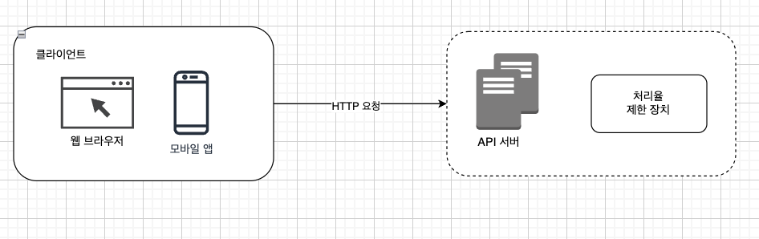
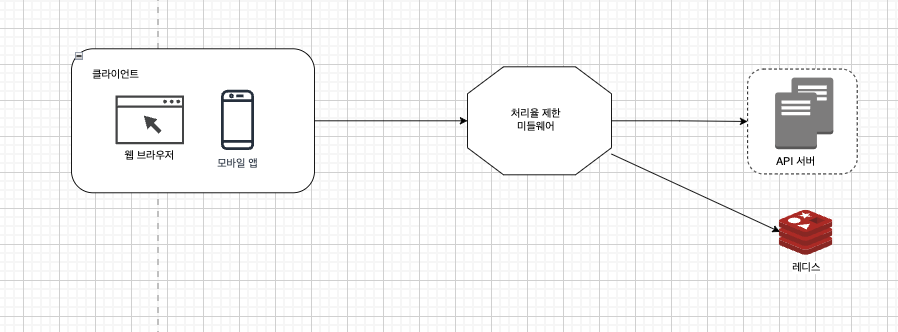
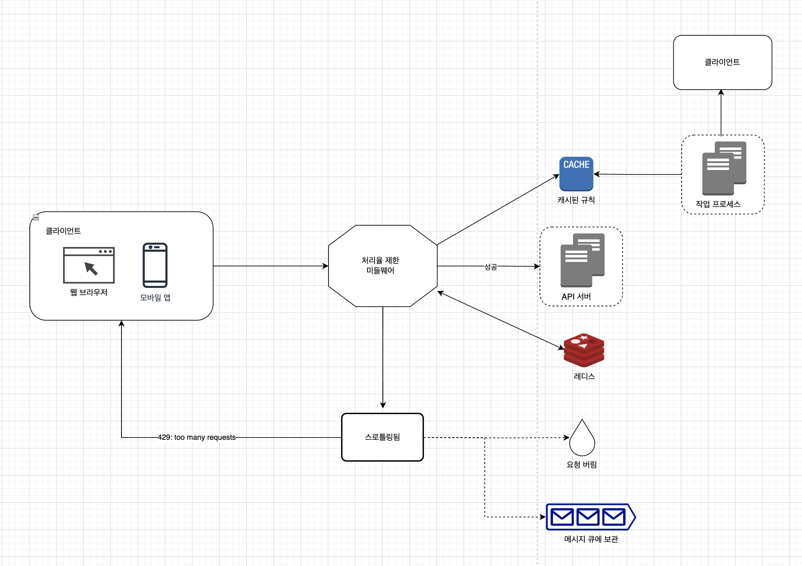
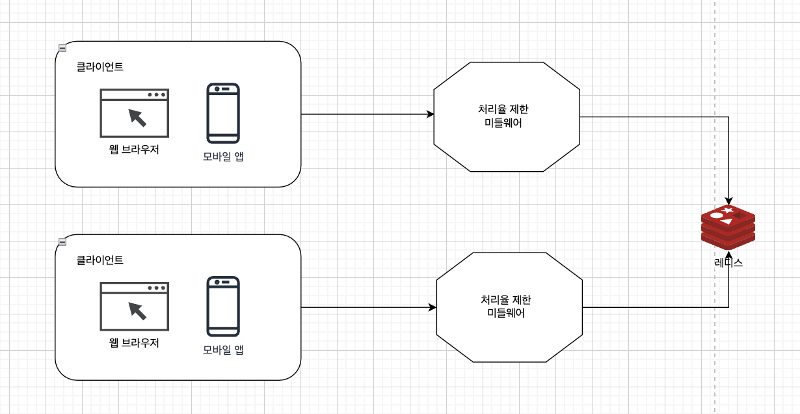

# 4. 처리율 제한 장치의 설계

## 처리율 제한 장치(rate limiter)?

클라이언트 또는 서비스가 보내는 트래픽의 처리율(rate)을 제어하기 위한 장치

- ex. HTTP (애플리케이션 계층)
    - 처리율 제한 장치는 특정 기간 내에 전송되는 클라이언트의 요청 횟수를 제한한다.
    - API 요청 횟수가 제한 장치에 정의된 임계치(threshold)를 넘어서면 추가로 도달한 모든 호출은 처리가 중단(block)된다.
- 사례
    - 사용자는 초당 2회 이상 새 글을 올릴 수 없다.
    - 같은 IP 주소로는 하루에 10개 이상의 계정을 생성할 수 없다.
    - 같은 디바이스로는 주당 5회 이상 리워드(reward)를 요청할 수 없다.

### API에 처리율 제한 장치를 두면 좋은 점

- DoS(Denial of Service) 공격에 의한 자원 고갈(resource starvation)을 방지할 수 있다. 처리율 제한 장치는 추가 요청에 대해서는 처리를 중단함으로써 DoS 공격을 방지한다.
    - ex. 트위터
        - 3시간 동안 300개의 트윗만 올릴 수 있도록 제한하고 있다.
    - ex. 구글 독스 API
        - 사용자당 분당 300회의 read 요청만 허용한다.
- 비용을 절감한다. 추가 요청에 대한 처리를 제한하면 서버를 많이 두지 않아도 되고, 우선순위가 높은 API에 더 많은 자원을 할당할 수 있다.
    - 처리율 제한은 제3자(third-party) API에 사용료를 지불하고 있는 회사들에게는 아주 중요하다. 다음의 경우 과금이 횟수에 따라 이루어진다면, 그 횟수를 제한할 수 있어야 비용을 절감할 수 있다.
        - 신용을 확인
        - 신용카드 결제
        - 건강 상태를 확인하거나 하기 위해 호출하는 API
- 서버 과부하를 막는다.
    - 봇(bot)에서 오는 트래픽이나 사용자의 잘못된 이용 패턴으로 유발된 트래픽을 걸러내는데 처리율 제한 장치를 활용할 수 있다.

## 개략적 설계

### 요구사항

- 설정된 처리율을 초과하는 요청은 정확하게 제한한다.
- 낮은 응답시간 : 이 처리율 제한 장치는 HTTP 응답시간에 나쁜 영향을 주어서는 곤란하다.
- 가능한 적은 메모리를 써야 한다.
- 분산형 처리율 제한(distributed rate limiting) : 하나의 처리율 제한 장치를 여러 서버나 프로세스에서 공유할 수 있어야 한다.
- 예외 처리 : 요청이 제한되었을 때는 그 사실을 사용자에게 분명하게 보여주어햐 한다.
- 높음 결함 감내성 (fault tolerance) : 제한 장치에 장애가 생기더라도 전체 시스템에 영향을 주어서는 안 된다.

### 개략적 설계안 : 처리율 제한 장치는 어디에 둘 것인가?

1. 클라이언트 측에 둔다면
    - 클라이언트 요청은 쉽게 위변조가 가능해서 클라이언트는 처리율 제한을 안정적으로 걸 수 있는 장소가 못 된다.
    - 모든 클라이언트의 구현을 통제하는 것도 어렵다.
2. 서버

   

3. 미들웨어
    - 처리율 제한 장치를 API 서버에 두는 대신, 처리율 제한 미들웨어를 만들어 해당 미들웨어로 하여금 API 서버로 가는 요청을 통제한다.
    - 클라우드 마이크로서비스 같은 경우, 처리율 제한 장치는 보통 API 게이트웨이라 불리는 컴포넌트에 구현된다.

   


- 설계 시 지침
    - 프로그래밍 언어, 캐시 서비스 등 현재 사용하고 있는 기술 스택을 점검
        - 현재 사용하고 있는 프로그래밍 언어가 서버 측 구현을 지원하기 충분할 정도로 효율이 높은지 확인
    - 사업 필요에 맞는 처리율 제한 알고리즘 찾기
        - 서버 측에서 모든 것을 구현 → 알고리즘은 자유롭게 선택할 수 있다.
        - 게이트웨이 → 선택지는 제한될 수 있다.
    - 마이크로서비스이고 사용자 인증이나 IP 허용목록 관리 등을 처리하기 위해 API 게이트웨이를 이미 설계에 포함시켰다면 처리율 제한 기능 또한 게이트웨이에 포함시켜야 할 수도 있다.
    - 처리율 제한 서비스를 직접 만드는 데는 시간이 든다. 처리율 제한 장치를 구현하기에 충분한 인력이 없다면 상용 API 게이트웨이를 쓰는 것이 바람직한 방법일 수도 있다.

### 처리율 제한 알고리즘

- 토큰 버킷 (token bucket)
- 누출 버킷 (lecky bucket)
- 고정 윈도 카운터 (fixed window counter)
- 이동 윈도 로그 (sliding window log)
- 이동 윈도 카운터 (sliding window counter)

### 개략적인 아키텍처

- 처리율 제한 알고리즘의 기본 아이디어
    - 얼마나 많은 요청이 접수되었는지를 추적할 수 있는 **카운터**를 **추적 대상**별로 두고, 이 카운트의 값이 어떤 한도를 넘어서면 한도를 넘어 도착한 요청은 거부하는 것
        - 추적 대상
            - 사용자?
            - IP 주소?
            - API 엔드포인트?
            - 서비스 단위?
        - 카운터(어디에 보관할 것인가?)
            - 데이터베이스? → 디스크 접근 때문에 느리므로 사용하면 안된다.
            - 캐시? → 빠르고 시간에 기반한 만료 정책을 지원한다.
    - 보통 레디스를 처리율 제한 장치를 구현할 때 자주 사용한다. INCR과 EXPIRE 두 가지 명령어를 지원한다.
        - `INCR` : 메모리에 저장된 카운터의 값을 1만큼 증가시킨다.
        - `EXPIRE` : 카운터에 타임아웃 값을 설정한다. 설정된 시간이 지나면 카운터는 자동으로 삭제된다.
- 처리율 제한 장치 구조
    - 클라이언트가 처리율 제한 미들웨어에게 요청을 보낸다.
    - 처리율 제한 미들웨어는 레디스의 지정 버킷에서 카운터를 가져와서 한도에 도달했는지 아닌지를 검사한다.
        - 한도에 도달했다면 요청은 거부된다.
        - 한도에 도달하지 않았다면 요청은 API 서버로 전달된다. 미들웨어는 카운터 값을 증가시킨 후 다시 레디스에 저장한다.



- 동작 원리
    - 클라이언트가 처리율 제한 미들웨어에게 요청을 보낸다.
    - 처리율 제한 미들웨어는 레디스의 지정 버킷에서 카운터를 가져와서 한도에 도달했는지 아닌지를 검사한다.
        - 한도에 도달했다면 요청은 거부된다.
        - 한도에 도달하지 않았다면 요청은 API 서버로 전달된다. 미들웨어는 카운터 값을 증가시킨 후 다시 레디스에 저장한다.

## 상세 설계

- 처리율 제한 규칙은 어떻게 만들어지고 어디에 저장되는가?
- 처리가 제한된 요청들은 어떻게 처리되는가?

### 처리율 제한 규칙

```
domain: messaging
descriptors:
  - key: message_type
  rate_limit:
    unit: day
    requests_per_unit: 5
```

- 시스템이 처리할 수 있는 마케팅 메시지 최대치 하루 5개 제한

이러한 처리율 제한 규칙은 보통 설정 파일(configurationfile) 형태로 디스크에 저장된다.

### 처리율 한도 초과 트래픽의 처리

- 한도 초과시 → API는 HTTP 429(too many requests)을 클라이언트에게 보낸다.
    - 한도 제한이 걸린 메시지를 나중에 처리하기 위해 큐에 보관할 수도 있음
        - ex. 어떤 주문이 시스템 과부하 때문에 한도 제한에 걸린 상황 → 해당 주문들을 보관했다가 나중에 처리할 수 있음.
- 처리율 제한 장치가 사용하는 HTTP 응답 헤더
    - `X-Ratelimit-Remaining` : 윈도 내에 남은 처리 가능 요청의 수
    - `X-Ratelimit-Limit` : 매 윈도마다 클라이언트가 전송할 수 있는 요청의 수
    - `X-Ratelimit-Retry-After` : 한도 제한에 걸리지 않으려면 몇 초 뒤에 요청을 다시 보내야 하는지 알림



- 처리율 제한 규칙은 디스크에 보관한다. 작업 프로세스(workers)는 수시로 규칙을 디스크에 읽어 캐시에 저장한다.
- 클라이언트가 요청을 서버에 보내면 요청은 먼저 처리율 제한 미들웨어에 도달한다.
- 처리율 제한 미들웨어는 제한 규칙을 캐시에서 가져온다. 그리고 카운터 및 마지막 요청의 타임스탬프(timestamp)를 레디스 캐시에서 가져온다.
    - 해당 요청이 처리율 제한에 걸리지 않은 경우 → API 서버로 보낸다.
    - 해당 요청이 처리율 제한에 걸린 경우 → 429 too many requests 에러를 클라이언트에 보낸다. 해당 요청은 그대로 버릴 수도 있고, 메시지 큐에 보관할 수도 있다.

### 분산 환경에서 처리율 제한 장치의 구현

분산 환경에서 처리율 제한 장치를 구현할 때 다음 두 가지 문제를 풀어야 한다.

- 경쟁 조건 (race condition)
    - 경쟁 조건 문제를 해결하는 가장 널리 해결된 해결책은 락(lock)이다. 하지만 락은 시스템의 성능을 상당히 떨어뜨린다는 문제가 있다. 락 대신 쓸 수 있는 해결책은 두 가지가 있다.
        1. 루아 스크립트(Lua script)
        2. 레디스의 sorted set 자료구조 사용
- 동기화 (synchronization)
    - 수백만 사용자를 지원하려면 한 대의 처리율 제한 장치 서버로 충분하지 않을 수 있다. 그래서 여러 대 서버를 두게 되면 동기화가 필요해진다.
        - 레디스 같은 중앙 집중형 데이터 저장소를 사용한다.



- 성능 최적화
    - 데이터센터를 지원하는 문제
        - 데이터센터에서 멀리 떨어진 사용자 지원 → 지연시간(latency) 증가
            - 대부분의 클라우드 서비스 사업자는 에지 서버를 두고 있음. 사용자의 트래픽을 가장 가까운 에지 서버로 전달하여 지연시간을 줄인다.
    - 처리율 제한 장치 간 데이터 동기화할 때 최종 일관성 모델 사용
- 모니터링
    - 채택된 처리율 제한 알고리즘이 효과적이다.
        - 깜짝 세일 같은 이벤트로 트래픽이 급증할 때 처리율 제한 장치가 비효율적으로 동작한다면, 그런 트래픽 패턴을 잘 처리할 수 있도록 알고리즘을 변경하는 것을 고려한다.
    - 정의한 처리율 제한 규칙이 효과적이다.
        - 규칙이 너무 빡빡하게 설정되었다면 많은 유효 요청이 처리되지 못하고 버려질 것이다. → 규칙 완화

## 마무리

- 추가로 학습하면 좋은 부분
    - 경성(hard) 또는 연성(soft) 처리율 제한
        - 경성 처리율 제한 : 요청한 개수는 임계치를 절대 넘어설 수 없다.
        - 연성 처리율 제한 : 요청 개수는 잠시 동안은 임계치를 넘어설 수 있다.
    - 다양한 계층에서의 처리율 제한
        - 애플리케이션 계층 외 다른 계층에서도 처리율 제한이 가능하다.
        - ex. Iptables를 사용하면 IP 주소(네트워크 계층)에 처리율 제한을 적용하는 것이 가능하다.
    - 처리율 제한을 회피하는 방법. 클라이언트를 어떻게 설계하는 것이 최선인가?
        - 클라이언트 측 캐시를 사용하여 API 호출 횟수를 줄인다.
        - 처리율 제한의 임계치를 이해하고, 짧은 시간 동안 너무 많은 메시지를 보내지 않도록한다.
        - 예외나 에러를 처리하는 코드를 도입하여 클라이언트가 예외적 상황으로부터 우아하게(gracefully) 복구될 수 있도록 한다.
        - 재시도(retry) 로직을 구현할 때는 충분한 백오프(back-off) 시간을 둔다.