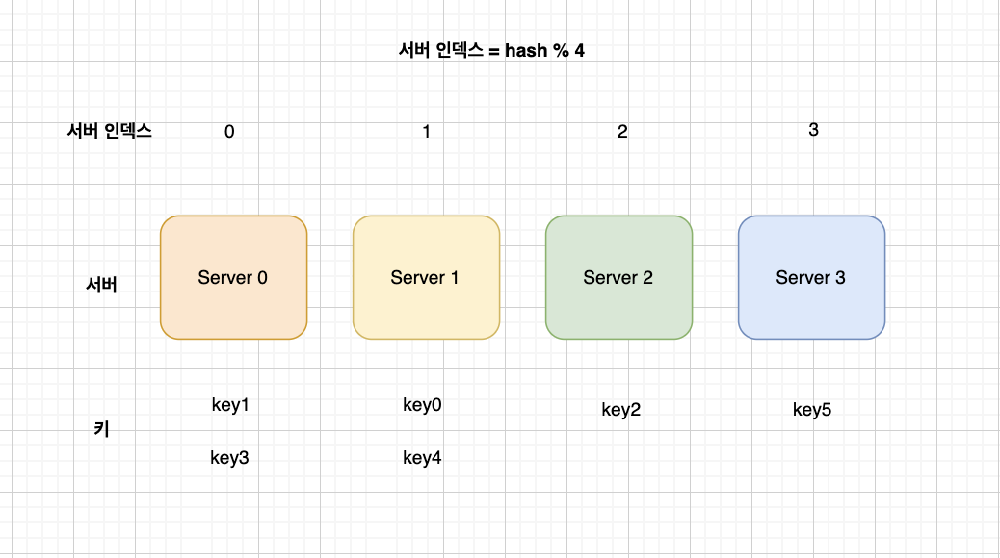

# 5장. 안정 해시 설계

수평적 규모 확장성을 달성하기 위해서?

- 데이터를 서버에 균등하게 나누는 것이 중요  ⇒ 안정 해시

## 해시 키 재배치(rehash) 문제

N개의 캐시 서버가 있을 때 부하를 균등하게 나누는 보편적인 방법

- serverIndex = hash(key) % N (N : 서버의 개수)

| 키 | 해시 | 해시 % 4 (서버 인덱스) |
| --- | --- | --- |
| key0 | 18358617 | 1 |
| key1 | 26143584 | 0 |
| key2 | 18131146 | 2 |
| key3 | 35863496 | 0 |
| key4 | 34085809 | 1 |
| key5 | 27581703 | 3 |

hash(key0) % 4 = 1 이면 클라이언트는 캐시에 보관된 데이터를 가져오기 위해 서버1에 접속해야 한다. 

서버 풀(server pool)의 크기가 고정되어 있을 때, 데이터 분포가 균등할 때는 잘 동작한다. 

### 단점

- 서버의 개수(N)가 변할 때 전체 데이터의 해시 값을 다시 계산해야 한다

Server1이 장애를 일으켜 동작이 중단될 경우 서버 풀의 크기는 3으로 변한다. 이 때 해시 값이 다시 계산된다.

| 키 | 해시 | 해시 % 3 (서버 인덱스) |
| --- | --- | --- |
| key0 | 18358617 | 0 |
| key1 | 26143584 | 0 |
| key2 | 18131146 | 1 |
| key3 | 35863496 | 2 |
| key4 | 34085809 | 1 |
| key5 | 27581703 | 0 |

그 결과 장애가 발생한 1번 서버에 보관되어 있는 키 뿐만 아닌 대부분의 키가 재분배되었다.

1번 서버가 죽으면 대부분 캐시 클라이언트가 데이터가 없는 엉뚱한 서버에 접속하게 된다 (대규모 캐시 미스)

## 안정 해시

- 해시 테이블의 크기가 조정될 때 평균적으로 오직 k/n개의 키만 재배치하는 해시 기술
    - k : 키의 개수
    - n : 슬롯의 개수

> 대부분 전통적 해시 테이블은 슬롯의 수가 바뀌면 거의 대부분 키를 재배치한다.

### 동작 원리

ex. 해시 함수 f (SHA-1 사용)

- 출력 값 범위 : x0, x1, x2, … xn
- SHA-1의 해시 공간 범위는 0 ~ $2^{160}$ -1
    - x0 → 0, xn → $2^{160}$ -1

- 해시 공간

- 해시 링

해시 공간의 양쪽을 접으면 해시 링(hash ring)이 만들어진다.

- 해시 서버

해시 함수 f를 사용하면 서버 IP나 이름을 링 위의 어떤 위치에 대응시킬 수 있다.

- 해시 키

캐시할 키 key0(k0), key1(k1), key2(k2), key3 또한 해시 링 위의 어느 지점에 배치된다.

> 여기 사용된 해시 함수는 ‘해시 키 재배치 문제’에 언급된 함수(나머지 연산 %)와 다르다.
> 

- 서버 조회

어떤 키가 저장되는 서버는, 해당 키의 위치로부터 시계 방향으로 링을 탐색해나가면서 만나는 첫 번째 서버.

- k0 → s0
- k1 → s1
- k2 → s2
- ke → s3

- 서버 추가

서버를 추가하더라도 키 가운데 일부만 재배치하면 된다.

- 서버 제거

하나의 서버가 제거되면 키 가운데 일부만 재배치된다. 

## 안정 해시 알고리즘의 문제점

- 안정 해시 알고리즘
    - 서버와 키를 균등 분포(uniform distribution) 해시 함수를 사용해 해시 링에 배치한다.
    - 키의 위치에서 링을 시계 방향으로 탐색하다 만나는 최초의 서버가 키가 저장될 서버다.

### 문제점

- 서버가 추가되거나 삭제되는 상황을 감안하면 파티션(partition)의 크기를 균등하게 유지하는 게 불가능하다.
    - 파티션 : 인접한 서버 사이의 해시 공간
    - 어떤 서버는 굉장히 작은 해시 공간을 할당 받고, 어떤 서버는 굉장히 큰 해시 공간을 할당 받는 상황이 가능하다.
- 키의 균등 분포(uniform distribution)를 달성하기 어렵다.

### 해결책

- 가상 노드(virtual node) 또는 복제(replica)

## 마무리

### 안정 해시 이점

- 서버가 추가되거나 삭제될 때 재배치되는 키의 수가 최소화된다.
- 데이터가 보다 균등하게 분포하게 되므로 수평적 규모 확장성을 달성하기 쉽다.
- 핫스팟(hotspot) 키 문제를 줄인다. 특정한 샤드(shard)에 대한 접근이 지나치게 빈번하면 서버 과부하 문제가 생길 수 있다.

### 실제 활용 예시

- 아마존 Dynamo DB의 파티셔닝 관련 컴포넌트
- 아파치 Cassandra 클러스터에서의 데이터 파티셔닝
- Discord 채팅 어플리케이션
- Akamai CDN
- Meglev 네트워크 부하 분산기